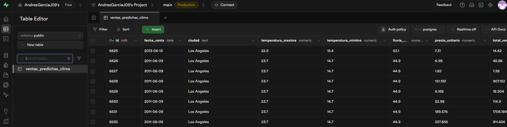
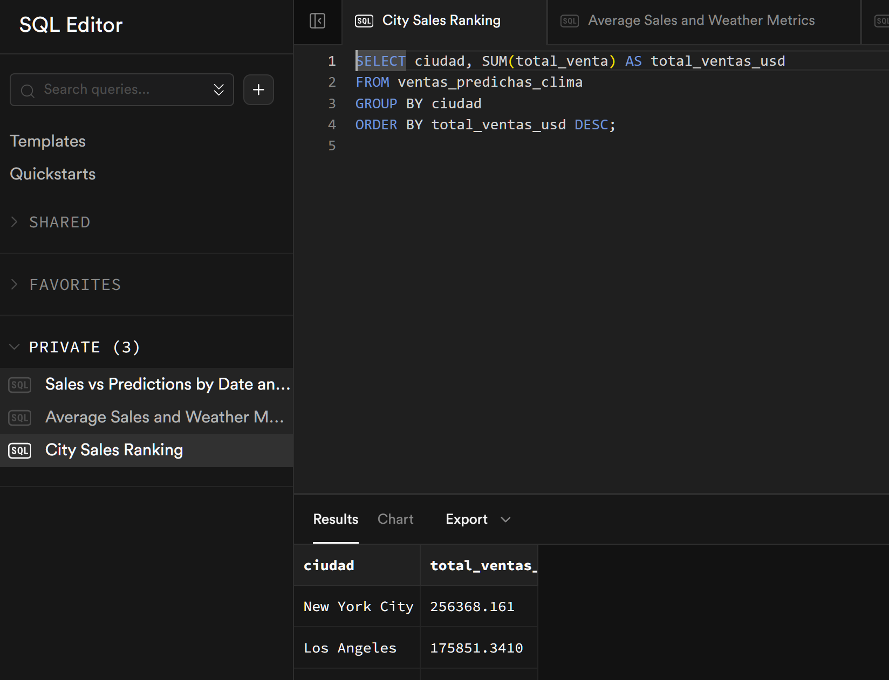
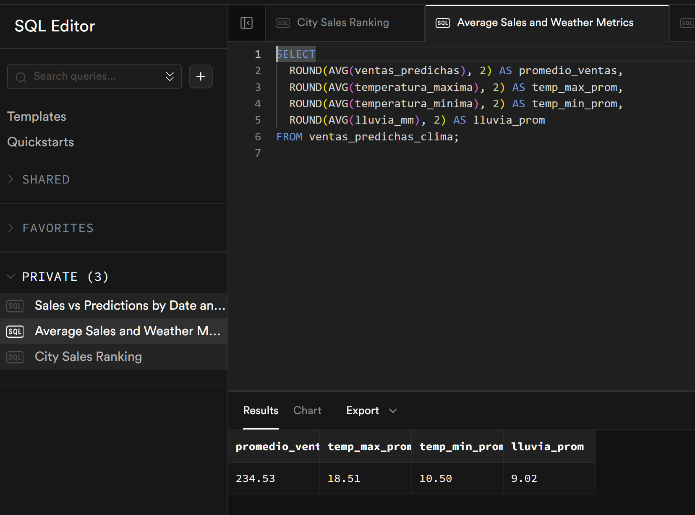
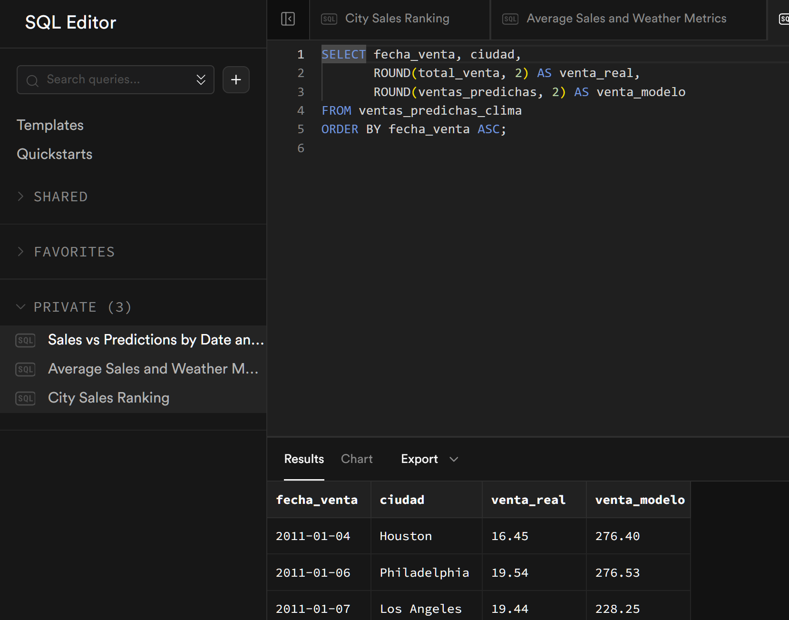

# 📊 Rainwear Sales Prediction Based on Weather Data

Este repositorio contiene un proyecto de ciencia de datos cuyo objetivo fue explorar si es posible predecir las ventas de productos impermeables con base en variables climáticas como la temperatura y la precipitación.

## 🧠 Objetivo del Proyecto

Analizar la relación entre el clima (temperatura máxima, mínima y precipitaciones) y las ventas de una tienda minorista, y evaluar si un modelo de regresión lineal permite predecir dichas ventas con precisión.

---

## 📁 Estructura del Proyecto

```bash
rainwear-sales-prediction/
│
├── data/
│   ├── Superstore_con_clima.csv            # Dataset original fusionado con clima
│   ├── ventas_predichas_solo_clima.csv     # Datos con predicciones generadas por el modelo
│   └── ventas_predichas_limpio.csv         # Archivo limpio para subida a Supabase
│
├── images/                                 # Carpeta de resultados visuales
│   ├── 01. Mapa de calor de correlación clima vs ventas.png
│   ├── 02. Ventas reales vs ventas predichas.png
│   ├── 03. Relación entre ventas reales y predichas.png
│   ├── 04. Distribución del error absoluto.png
│   ├── SQL1.png                             # Consulta SQL: Comparación entre ventas reales y predichas
│   ├── SQL2.png                             # Consulta SQL: Métricas climáticas y de ventas promedio
│   ├── SQL3.png                             # Consulta SQL: Ranking de ventas por ciudad
│   └── superbase.png                        # Imagen de tabla publicada en Supabase
│
├── scripts/
│   ├── entrenar_modelo.py                  # Script que entrena el modelo de regresión
│   ├── Limpiar.py                          # Script de limpieza del dataset
│   └── cargar_a_supabase.py                # Script que sube los datos a Supabase
│
├── dashboard_looker/                       # Reporte conectado a Supabase
│
├── README.md                               # Este archivo
└── requirements.txt                        # Librerías necesarias
```

---

## 🗃️ Dataset Utilizado

Se utilizó el dataset **Superstore Sales**, disponible públicamente en Kaggle:

🔗 [Kaggle - Superstore Sales Dataset](https://www.kaggle.com/datasets/ishanshrivastava28/superstore-sales?resource=download)

Este dataset contiene información detallada sobre transacciones de ventas, clientes, productos y envíos en distintas ciudades y regiones, permitiendo analizar tendencias y correlaciones relacionadas con la rentabilidad.

Para este proyecto, se enriqueció el dataset con variables climáticas por ciudad y fecha, usando fuentes meteorológicas externas.

---

## 🔬 Análisis Exploratorio y Modelo Predictivo

Tras realizar una limpieza y análisis exploratorio del dataset, se generaron gráficos de correlación y dispersión que permitieron observar visualmente la relación entre las variables climáticas y las ventas.

### ❗ Hallazgos Clave

* **No se evidenció una correlación significativa** entre temperatura o precipitaciones y el comportamiento de ventas.
* **Las ventas parecieron responder a otros factores** como tipo de producto, descuentos o campañas, más que al clima directamente.
* **El modelo de regresión lineal entrenado tuvo un bajo desempeño** con valores de R² cercanos a 0, indicando que no era capaz de explicar la variación de las ventas.

### 📉 Métricas del Modelo

```text
MAE (Error absoluto medio): ~60 USD
R² (Coeficiente de determinación): 0.02
```

Esto indica que el modelo **no es viable para predicción real**, al menos con las variables disponibles en este contexto.

---

## 📸 Resultados Visuales

A continuación se presentan algunos gráficos generados durante el análisis:

### 01. Mapa de calor de correlación: clima vs ventas


### 02. Ventas reales vs ventas predichas


### 03. Relación entre ventas reales y predichas


### 04. Distribución del error absoluto


---

## 💾 Supabase

Los resultados se subieron exitosamente a una base de datos alojada en Supabase:

🔗 [Supabase REST API - Tabla pública](https://zblxsowtlzdearbcjytw.supabase.co/rest/v1/ventas_predichas_clima?select=*)

Tabla creada: `ventas_predichas_clima`

Columnas relevantes:

* `fecha_venta`
* `ciudad`
* `temperatura_maxima`
* `temperatura_minima`
* `lluvia_mm`
* `precio_unitario`
* `total_venta`
* `ventas_predichas`



---

## 📊 Dashboard en Looker Studio

Se construyó un dashboard interactivo en Looker Studio que permite visualizar:

* Distribución geográfica de ventas
* Tendencias climáticas vs. comportamiento comercial
* Comparación entre ventas reales y predichas
* Cantidad de registros en los que las ventas predichas fueron cercanas a las reales

🔗 [Enlace al dashboard](https://lookerstudio.google.com/s/hj5mG0SO9HE)

---

## 🔢 Consultas SQL (Capturas)

Como parte de la entrega, se realizaron las siguientes consultas sobre los datos almacenados en Supabase:

### SQL1: Comparación entre ventas reales y predichas



### SQL2: Promedios de ventas y variables climáticas



### SQL3: Ranking de ventas por ciudad



---

## ⏱️ Tiempo y Observaciones Finales

Debido al tiempo limitado (4 horas), este proyecto se completó parcialmente y sin automatización del flujo. Tal como se explicó previamente al equipo de reclutamiento, se intentó generar datos con IA a través de [Mockaroo](https://mockaroo.com/), pero se descartaron por no contar con ubicaciones geográficas reales, lo cual inhabilitaba cualquier intento serio de predicción climática.

Por tanto, se optó por usar el dataset de Kaggle citado, que permitió un análisis más coherente y completo. Sin embargo, **la tienda analizada no presentó una relación significativa entre clima y ventas**, por lo cual la predicción basada exclusivamente en variables climáticas fue fallida y el modelo resultó poco útil.

### Imágenes presentadas:

1. **Mapa de calor de correlación**: muestra que no hay correlación entre clima y ventas.
2. **Ventas reales vs. predichas**: el modelo no captura el patrón real.
3. **Relación real vs. predicha**: ventas predichas están todas por debajo de las reales.
4. **Distribución del error**: errores absolutos grandes en la mayoría de casos.
5. **Consultas SQL**: respaldan análisis por ciudad, métricas agregadas y ventas temporales.

---

## 🚫 Automatización (Pendiente)

La automatización con `n8n` o `cron` quedó fuera del alcance de esta primera entrega. En futuras versiones, se prevé:

* Programar la ejecución semanal del modelo.
* Automatizar la carga de datos nuevos en Supabase.
* Refrescar el dashboard automáticamente.

---

## 🛠️ Requerimientos

```bash
pandas
requests
scikit-learn
sqlalchemy
psycopg2-binary
python-dotenv
matplotlib
geopy
```

Instalación:

```bash
pip install -r requirements.txt
```

---

## 👤 Autor

Andrés García
📧 Andres Garcia
🔗 [GitHub Profile](https://github.com/AndresGarciaJ09)

---

📦 Entrega realizada antes del mediodía del viernes 18 de julio como fue acordado con el equipo re
